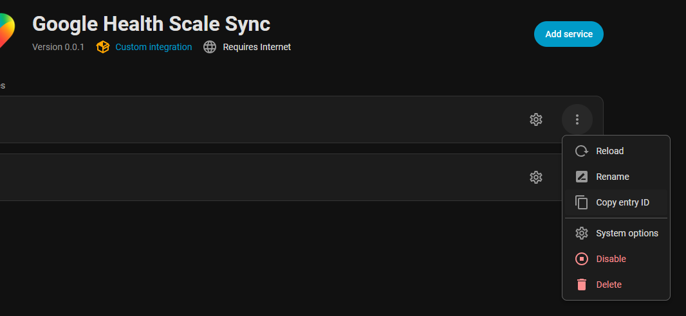
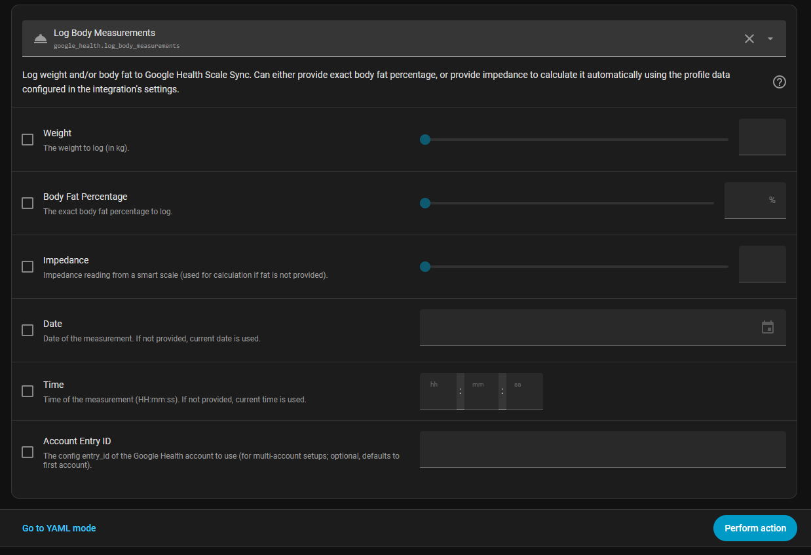

# Google Health Scale Sync for Home Assistant

A custom component for Home Assistant that logs body measurements (weight and body fat percentage) directly to the Google Health API v4. This integration uses the new Google Health API, replacing the legacy Fitbit API which is scheduled for deprecation.

**This component is fully HACS-compliant.**

> **Note:** Your account must be linked to a Google Account. You will need to create a Google Cloud project and OAuth 2.0 credentials as described below.

---

## Features

- **Log Body Measurements**: A unified google_health.log_body_measurements action to easily record weight and body fat.
- **Smart Body Fat Calculation**: If you only have raw impedance and weight readings (like from a smart scale), this integration uses the height, date_of_birth, and gender you provide during the setup process to calculate your body fat percentage accurately before logging it!

## Installation

### Method 1: HACS (Recommended)
1. Open Home Assistant and navigate to **HACS**.
2. Click the three dots in the top right corner and select **Custom repositories**.
3. Add the URL of this repository: https://github.com/vinodmishra/ha-googlehealthscalesync
4. Select the category **Integration**.
5. Click **Add** and then download the newly available **Google Health Scale Sync** integration.
6. Restart Home Assistant.

### Method 2: Manual
1. Download or clone this repository.
2. Copy the custom_components/google_health directory to your custom_components directory in your Home Assistant configuration folder.
3. Restart Home Assistant.

## Configuration & Setup

This integration uses the **Google Health API v4**, which requires a Google Cloud project with OAuth 2.0 credentials.

### Step 1: Create a Google Cloud Project

1. Go to [Google Cloud Console](https://console.cloud.google.com/) and sign in with your Google Account.
2. Click **Select a project** ? **New Project**.
3. Give it a name (e.g. Home Assistant Google Health) and click **Create**.

### Step 2: Enable the Google Health API

1. In your new project, go to **APIs & Services ? Library**.
2. Search for **Google Health API** and click on it.
3. Click **Enable**.

### Step 3: Configure the OAuth Consent Screen

1. Go to **APIs & Services ? OAuth consent screen**.
2. Select **External** as the user type and click **Create**.
3. Fill in the required fields:
   - **App name**: Home Assistant (or anything you prefer)
   - **User support email**: your email address
   - **Developer contact email**: your email address
4. Click **Save and Continue**.
5. On the **Scopes** step, click **Save and Continue** (no need to add scopes manually here).
6. On the **Test users** step, add your own Google Account email address as a test user, then click **Save and Continue**.
7. Click **Back to Dashboard**.

### Step 4: Create OAuth 2.0 Credentials

1. Go to **APIs & Services ? Credentials**.
2. Click **+ Create Credentials ? OAuth client ID**.
3. Set **Application type** to **Web application**.
4. Give it a name (e.g. Home Assistant).
5. Under **Authorized redirect URIs**, click **Add URI** and enter:
   `
   https://my.home-assistant.io/redirect/oauth
   `
6. Click **Create**.
7. You will see your **Client ID** and **Client Secret**. Keep this dialog open (or download the JSON).

### Step 5: Add the Integration in Home Assistant

1. In Home Assistant, navigate to **Settings ? Devices & Services ? Add Integration**.
2. Search for **Google Health Scale Sync** and select it.
3. When prompted for credentials, enter your **Client ID** and **Client Secret** from Step 4.
4. Complete the Google OAuth authorization flow in your browser.
5. Enter your profile data (gender, date of birth, height) when prompted by the setup configuration screen.

> **Multi-account support:** To connect multiple Google Health accounts, simply add the integration again (Step 5).

## Logging Body Measurements: Blueprint or Manual Action

You can log weight and body composition data to Google Health in two ways:

- **Use the included Home Assistant blueprint** for easy, automated logging from your smart scale sensors (recommended for most users).
- **Call the google_health.log_body_measurements action directly** in your own automations or scripts (see documentation below).

### Quick Start: Add the Blueprint

Or, manually import the blueprint from this repo:
- Go to **Settings > Automations & Scenes > Blueprints** in Home Assistant.
- Click **Import Blueprint** and paste the url: https://github.com/vinodmishra/ha-googlehealthscalesync/blob/main/blueprints/google_health_body_scale_logger.yaml

**Features:**
- Logs weight, body fat %, and impedance to Google Health.
- Supports minimum/maximum weight thresholds for filtering.
- Multi-account support: select a Google Health entity to automatically route data to the correct profile (no need to manually find entry_id).
- Optional sensors for body fat and impedance.

**Inputs:**
- **Weight Sensor (Required):** The sensor providing your weight/mass reading.
- **Fat Sensor (Optional):** The sensor providing body fat percentage.
- **Impedance Sensor (Optional):** The sensor providing impedance data.
- **Google Health Target Profile (Optional):** Select the Google Health account you want to sync to. (Only required for multi-account setups).
- **Minimum/Maximum Weight Thresholds (Optional):** Only sync if weight is within these bounds.

---

## Using the log_body_measurements Action

You can find the google_health.log_body_measurements action in your Home Assistant Developer Tools or use it in automations.

### Example: Log weight and exact body fat percentage
`yaml
action: google_health.log_body_measurements
data:
  weight: 75.5
  fat: 15.2
`

### Example: Log weight and calculate body fat via impedance
`yaml
action: google_health.log_body_measurements
data:
  weight: 75.5
  impedance: 505
`
*Note: The integration will use the gender, height, and date of birth you entered during setup to perform the calculation!*

## Selecting a Specific Account (Multi-Account Support)

If you have multiple Google Health accounts configured, you can select which account to use when logging body measurements by specifying the entry_id in the service call.

### How to Find the entry_id

1. Go to **Settings > Devices & Services** in Home Assistant.
2. Click on the three dots (?) for the Google Health Scale Sync integration you want to use.
3. Select **System Options** or **Show Info** (depending on your Home Assistant version).
4. Copy the entry_id value as shown below:

### Example: Log weight for a specific account
`yaml
action: google_health.log_body_measurements
data:
  weight: 75.5
  entry_id: "your_entry_id_here"
`

### New Service Action in Developer Tools

You will see the new entry_id field available when calling the service in Home Assistant Developer Tools:

